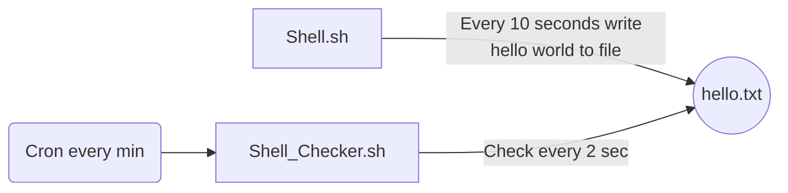

# DEVOPS

Goal: Spring boot,minikube ve ingress kullanarak bir web sunucusu oluşturma.
DEVOPS dir'in altında bulunan **web1**  **web2** projeleri spring boot ile oluşturulmuştur.
Projeler içerisinde Dockerfile' lar hazırlanmıştır.

İlerleyen aşamalarda minukube kullanacağımız için docker image'leri docker hub'ıma upload ettim.
- **Start**
 > docker build -t bahadir23/vodafone:web1 ./web1 .
 > 
 > docker build -t bahadir23/vodafone:web2 ./web2 .

- **Eğer test etmekj istenir ise aşağıdaki gibi testler gerçekleştirilebilir.**

>docker run -p 8080:8080 bahadir23/vodafone:web1
>
>curl -k http://localhost:8080

- **Minikube**
Projede k8s olarak minikube cluster kullandım.
 [Minikube kurulumunu](https://minikube.sigs.k8s.io/docs/start/) bu link üzerinden gerçekleştirebilirsiniz.
 Ben local kurulum yerine kolay ve hızlı olan  [Katacoda](https://www.katacoda.com/ )  yı tercih ettim. 
 Online olarak minikube bash ile çalışabiliyorsunuz.
 
Gerekli kurulumlar gerçekleştikten sonra :
- Minikube ingress aktive etme
> minikube addons enable ingress 
- Minikube deployment oluşturma 
> kubectl create deployment web1 --image=bahadir23/vodafone:web1
> 
> kubectl create deployment web2 --image=bahadir23/vodafone:web2

- Minikube port expose ederek projeyi ayağa kaldırma
> kubectl expose deployment web1 --type=NodePort --port=8080 
> 
> kubectl expose deployment web2 --type=NodePort --port=8080 
> 
- Projeler 8080 portundan web yayını yapmaktadır ve son adım olarak ingress e geçiyoruz.

### İngress conf

- İngress conf aktif edilmesi
> kubectl apply -f  ingress.yaml

### Test 
- Service url  
> kubectl get service web1 
> 
> kubectl get service web2

> curl -k <service_url>
> 
> curl -k <service_url>/v2

"Greetings from Spring Boot!"     Ve   "Greetings from Spring Boot! web2"
şeklinde response alabilirsiniz.
#### Not
Yeni şeyler öğrenmek gerçekten çok güzel :)).
Projede CI/CD tarafı için jenkins kullanmam gerekirken gitlab kullanmayı tercih ettim.
[gitlab-ci.yml 'a](https://github.com/byalcin23/training/blob/main/DEVOPS/gitlab-ci.yml "gitlab-ci.yml") buradan ulaşabilirsiniz
Projeyi internet ortamına açmam için sunucum olmadığından yerleştiremedim.

# MONGO SQL
[MongoD.sql](https://github.com/byalcin23/training/blob/main/MONGO/MongoD.sql "MongoD.sql") Buradan ulaşabilirsiniz.

# ORACLE SQL
[ORACLE.sql](https://github.com/byalcin23/training/blob/main/ORACLE/ORACLE.sql "ORACLE.sql") Buradam ulaşabilirsiniz.

# SHELL SCRIPTING
- Tasks:
1-Write a shell script which write "Hello world" for every 10 seconds into a temp file (hello.txt) 
2-Run sh as a daemon process. 
3-Write another shell script to check the count of records in hello.txt, if total count is equal 10 then kill the first sh, delete the temp file and run first sh again.
- Done
 1) [Shell.sh](https://github.com/byalcin23/training/blob/main/SHELL_SCRIPTING/Shell.sh "Shell.sh")
 2)  setsid ./Shell.sh > output.log 2>&1 < output.log &
 3) [Shell_Checker.sh](https://github.com/byalcin23/training/blob/main/SHELL_SCRIPTING/Shell_Checker.sh "Shell_Checker.sh")
4) [crontab.txt](https://github.com/byalcin23/training/blob/main/SHELL_SCRIPTING/crontab.txt "crontab.txt")

#### Not
Crontab minumum 1 dakika interval ile çalıştığı için her dakika çalışıcak şekilde ayarlandı.
Fakat [Shell.sh](https://github.com/byalcin23/training/blob/main/SHELL_SCRIPTING/Shell.sh "Shell.sh") her 10 saniyede bir işlem yaptığı için satır sayısı 10 olduğunda 100 saniye geçmiş oluyordu ve cron 60 saniyede bir devreye girdiği için satır sayısının 10 sayısına eşit olduğunu doğrulayamıyordu.
Bu yüzden [Shell_Checker.sh](https://github.com/byalcin23/training/blob/main/SHELL_SCRIPTING/Shell_Checker.sh "Shell_Checker.sh") içerisine 30 kere 2 saniye bekleme şeklinde for döngüsü eklenmiştir.
***Sonuç olarak***
Her dakika tetiklenen cron  loop sayesinde her 2 saniyede bir  hello.txt dosyasını kontrol ediyor.

flow chart:

ENGLISH

# DEVOPS

Goal: Creating a webserver using spring boot,minikube and ingress.
**web1** **web2** projects under DEVOPS dir were created with spring boot.
Dockerfiles were prepared within the projects.

I uploaded the docker images to my docker hub as we will be using minukube in the future.
- **Start**
  > docker build -t bahadir23/vodafone:web1 ./web1 .
  >
  > docker build -t bahadir23/vodafone:web2 ./web2 .

- **If testing is desired, tests such as the following can be performed.**

>docker run -p 8080:8080 bahadir23/vodafone:web1
>
>curl -k http://localhost:8080

- **Minikube**
I used minicube cluster as k8s in the project.
  You can install [Minikube](https://minikube.sigs.k8s.io/docs/start/) via this link.
  I preferred [Katacoda](https://www.katacoda.com/ ), which is easy and fast, instead of local installation.
  You can work online with minikube bash.
 
After the necessary installations are done:
- Activate Minikube ingress
>minikube addons enable ingress
- Minikube deployment creation
> kubectl create deployment web1 --image=bahadir23/vodafone:web1
>
> kubectl create deployment web2 --image=bahadir23/vodafone:web2

- Boot up the project by expose Minikube port
> kubectl expose deployment web1 --type=NodePort --port=8080
>
> kubectl expose deployment web2 --type=NodePort --port=8080
>
- Projects are broadcasting from port 8080 and as the last step, we switch to ingress.

### Ingress conf

- Activating ingress conf
> kubectl apply -f ingress.yaml

### Test
- Service url
> kubectl get service web1
>
> kubectl get service web2

> curl -k <service_url>
>
> curl -k <service_url>/v2

"Greetings from Spring Boot!" And "Greetings from Spring Boot! web2"
You can get a response in the form.
#### Note
It's really nice to learn new things :)).
I preferred to use gitlab when I needed to use jenkins for the CI/CD side of the project.
[to gitlab-ci.yml](https://github.com/byalcin23/training/blob/main/DEVOPS/gitlab-ci.yml "gitlab-ci.yml") can be found here
Since I do not have a server to open the project on the internet, I could not place it.

# MONGO SQL
[MongoD.sql](https://github.com/byalcin23/training/blob/main/MONGO/MongoD.sql "MongoD.sql") You can find it here.

# ORACLE SQL
[ORACLE.sql](https://github.com/byalcin23/training/blob/main/ORACLE/ORACLE.sql "ORACLE.sql") You can find it here.

# SHELL SCRIPTING
- Tasks:
1-Write a shell script which write "Hello world" for every 10 seconds into a temp file (hello.txt)
2-Run sh as a daemon process.
3-Write another shell script to check the count of records in hello.txt, if total count is equal 10 then kill the first sh, delete the temp file and run first sh again.
- done
  1) [shell.sh](https://github.com/byalcin23/training/blob/main/SHELL_SCRIPTING/shell.sh "shell.sh")
  2) setsid ./shell.sh > output.log 2>&1 < output.log &
  3) [Shell_Checker.sh](https://github.com/byalcin23/training/blob/main/SHELL_SCRIPTING/Shell_Checker.sh "Shell_Checker.sh")
4) [crontab.txt](https://github.com/byalcin23/training/blob/main/SHELL_SCRIPTING/crontab.txt "crontab.txt")

#### Note
Since Crontab works with a minimum 1 minute interval, it is set to run every minute.
But since [shell.sh](https://github.com/byalcin23/training/blob/main/SHELL_SCRIPTING/shell.sh "shell.sh") processes every 10 seconds, when the number of rows is 10, 100 seconds have passed and cron was unable to verify that the number of rows was equal to 10 because it kicked in every 60 seconds.
That's why a for loop has been added in [Shell_Checker.sh](https://github.com/byalcin23/training/blob/main/SHELL_SCRIPTING/Shell_Checker.sh "Shell_Checker.sh"), waiting 30 times for 2 seconds.
***In conclusion***
Thanks to the cron loop that is triggered every minute, it checks the hello.txt file every 2 seconds.

